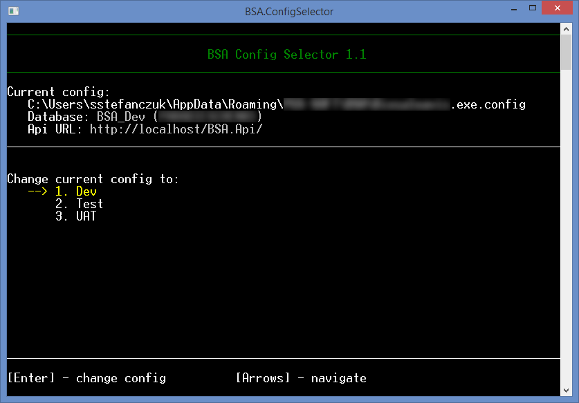

# BSA Config Selector

Simple console app for quick switching between different configurations of a desktop application that we develop. It helps our team (especially testers) in day-to-day work on different environments. The app solves problem with changing configuration files manually.

**Features**
----------------
- Displaying current config in friendly way e.g. parameters from AppSettings, database name and server name from connection string,
- The list of available configs is loaded dynamically - it is based on config files in shared location
- Replacing current config with the selected config. 

